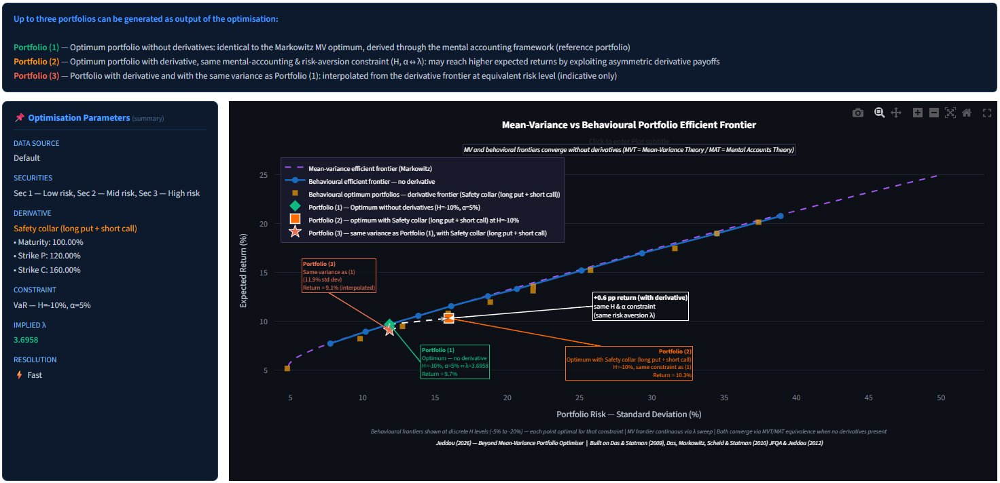

# Behavioral Portfolio Optimizer

> Extending Markowitz mean-variance theory to portfolios with derivatives and structured products using a mental-accounting framework.



---

## Overview

This project implements a **behavioural portfolio optimisation algorithm** that goes beyond classical mean-variance theory by:

- Incorporating **derivatives and structured products** (puts, calls, collars, straddles, strangles, capital-guaranteed notes, barrier-M notes) directly into the optimisation
- Using a **mental-accounting framework** with a downside risk constraint: the probability of the portfolio return falling below a threshold H must not exceed α
- Handling **non-normal return distributions** via Gaussian and Student-t copulas
- Proving the **equivalence between mean-variance and mental-accounting** optimisation at a given implied risk-aversion coefficient λ

The app provides three portfolio perspectives for comparison:

- **❶ No derivative** — optimal portfolio under the mental-account constraint without derivatives
- **❷ With derivative, same mental-accounting & risk-aversion constraint (H, α ↔ λ)** — optimal portfolio including the selected derivative, under the same downside constraint (H, α), equivalent to the same risk-aversion λ. This may achieve higher expected return but typically at higher variance, as the derivative satisfies the constraint more efficiently
- **❸ With derivative, same variance as ❶ (no-derivative portfolio)** — interpolated from the derivative frontier at the same standard deviation as portfolio ❶, showing the potential return gain from derivatives at an equivalent risk level

Under the default base case (H = -10%, α = 5%), a portfolio including an uncapped Capital-Guaranteed Note achieves **33.6% expected return** versus **10.2% without derivatives** under the same downside constraint.

---

## Theoretical Background

This work is based on the mental-accounting portfolio theory introduced in:

- **Das, Sanjiv and Meir Statman (2009)** — *Beyond Mean-Variance: Portfolios with Derivatives and Non-Normal Returns in Mental Accounts*
- **Das, Sanjiv, Harry Markowitz, Jonathan Scheid and Meir Statman (2010)** — *"Portfolio Optimization with Mental Accounts"*, Journal of Financial and Quantitative Analysis, Vol. 45, No. 2, pp. 311–334

The MVT/MAT equivalence (Chapter 4) shows that for a given threshold H and shortfall probability α, there exists an implied risk-aversion coefficient λ such that the mean-variance optimal portfolio and the behavioural optimal portfolio are identical — **when no derivatives are present**. Adding derivatives breaks this equivalence and reveals the superiority of the behavioural approach.

This Python implementation is a translation and extension of the original R program developed as part of:

> **Sami Jeddou** (2012) — *"Beyond Mean-Variance: Options and Structured Products in Behavioral Portfolios"*, Master in Finance Thesis, Università della Svizzera italiana (USI Lugano), supervised by Prof. Enrico De Giorgi

---

## Algorithm

The optimiser runs in three steps:

**Step 1 — State space construction**
A discrete grid of return scenarios is built for all primary securities. For each scenario, derivative returns are computed analytically using Black-Scholes pricing. The result is a matrix U of all possible return vectors across m^n′ states.

**Step 2 — Probability assignment**
Each state is assigned a probability using a Gaussian (or Student-t) copula, correctly capturing the dependence structure between assets including non-normal marginals.

**Step 3 — Two-stage optimisation**
- *Grid search*: All weight combinations are evaluated. Those satisfying the mental-account constraint (VaR or ES) are kept as eligible. The highest-return eligible portfolio is selected as the starting point.
- *Gradient refinement*: A COBYLA nonlinear optimiser refines the solution from that starting point, with the constraint embedded as a penalty term.

---

## Supported Derivatives

| Type | Description |
|---|---|
| `put` | Long put option |
| `call` | Long call option |
| `safety_collar` | Long put + short call |
| `aggressive_collar` | Long call + short put |
| `straddle` | Long call + long put (same strike) |
| `strangle` | Long call + long put (different strikes) |
| `cgn` | Capital-guaranteed note (capped or uncapped) |
| `barrier_m` | Barrier-M note |

---

## Project Structure

```
behavioral-portfolio-optimizer/
│
├── behavioral_portfolio_optimizer.py   # Core optimizer (Steps 1–3 + all derivative types)
├── app.py                              # Streamlit interactive dashboard
├── requirements.txt                    # Python dependencies
├── efficient_frontier_v2.png           # Frontier chart (used in README)
└── README.md
```

---


## Data Input

Three modes are supported for portfolio data:

| Mode | Description |
|---|---|
| **Default** | Das & Statman (2009) base case — 3 securities with pre-calibrated means, std devs, and correlations. Works out of the box, reproduces thesis results exactly. |
| **Manual entry** | Enter your own means, standard deviations, and correlation matrix directly in the sidebar. Supports 2–6 primary securities. |
| **CSV upload** | Upload a CSV of historical prices (date column + one column per asset). Means and covariances are computed automatically from daily returns. |

### CSV format

```
Date,Asset1,Asset2,Asset3
2020-01-02,100.00,100.00,100.00
2020-01-03,100.05,100.15,100.40
```

First column must be dates. Remaining columns are asset prices with the asset name as the header. A sample CSV is available for download directly in the app.

---

## Quickstart

### Run locally

```bash
# Install dependencies
pip install numpy scipy matplotlib streamlit fastapi uvicorn

# Run the optimiser directly
python behavioral_portfolio_optimizer.py

# Launch the interactive dashboard
streamlit run app.py

```

### Interactive dashboard

The Streamlit dashboard allows you to:
- Select derivative type from a dropdown
- Adjust the mental-account threshold H and shortfall probability α via sliders
- Visualise the three-curve efficient frontier (MV / Behavioral / Behavioral + derivative) in real time
- Read optimal portfolio weights and statistics for the selected parameters

🔗 **Live app**: [samijeddou-behavioral-portfolio-optimizer.streamlit.app](https://samijeddou-behavioral-portfolio-optimizer.streamlit.app)

### API

The FastAPI endpoint exposes the optimiser as a REST service:

```bash
POST /optimize
{
  "derivative_type": "cgn",
  "H": -0.10,
  "alpha": 0.05,
  "floor": 0.01,
  "participation": 1.0,
  "cap": null
}
```

---

## Key Results

| Configuration | Expected Return | Std Dev | Skewness |
|---|---|---|---|
| No derivative (H=-10%, α=5%) | 10.21% | 12.29% | 0.00 |
| With CGN — floor=0%, uncapped (H=-10%, α=5%) | 33.57% | 35.35% | 1.03 |
| Equivalence point: λ=3.795 ↔ H=-10%, α=5% | 10.23% | 12.30% | — |

The baseline result (10.21%) matches the thesis mean-variance result (10.23%) to within **2 basis points**, confirming correct algorithm calibration.

---

## Author

**Sami Jeddou**
Senior Financial Services Executive — Transformation, Risk & Capital Markets | Risk · Capital Markets · Post-Trade & Clearing · High-Value Payments · Quantitative Finance · Front-to-Back Delivery · Regulatory Programs

- 🔗 [LinkedIn](https://www.linkedin.com/in/sami-jeddou-25787a404)
- 📧 sami.jeddou@protonmail.com

---

## License

MIT License — see [LICENSE](LICENSE) for details.
