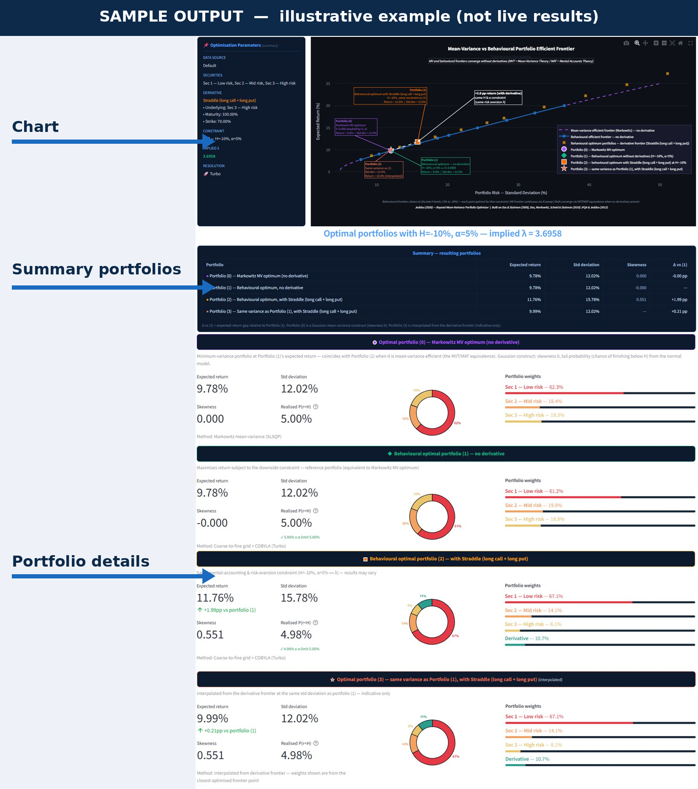
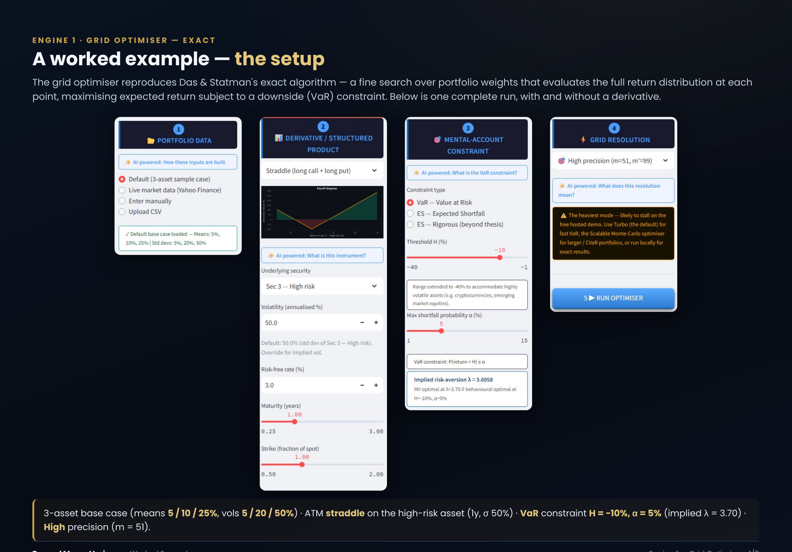
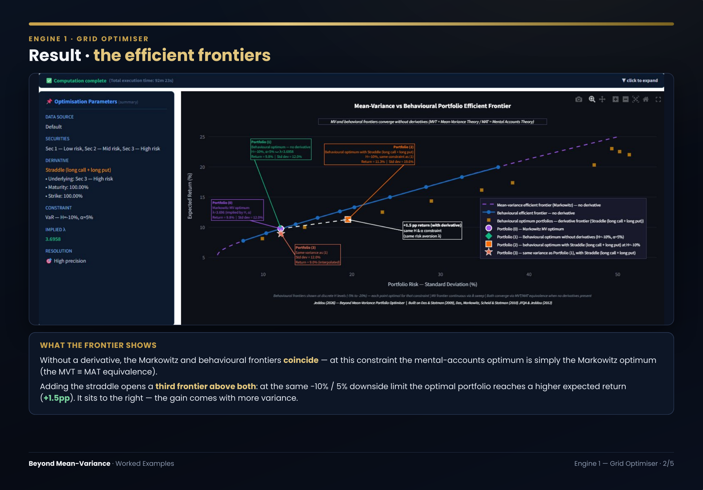

# Behavioral Portfolio Optimizer

> Extending Markowitz mean-variance theory to portfolios with derivatives and structured products using a mental-accounting framework.

**© 2026 Sami Jeddou — All rights reserved.** Published publicly for demonstration and evaluation only; **no license is granted** (see [LICENSE](LICENSE)). No copying, modification, redistribution, or reuse without the author's prior written permission.



---

## Overview

This project implements a **behavioural portfolio optimisation algorithm** that goes beyond classical mean-variance theory by:

- Incorporating **derivatives and structured products** (puts, calls, collars, straddles, strangles, capital-guaranteed notes, barrier-M notes) directly into the optimisation
- Using a **mental-accounting framework** with a downside risk constraint: the probability of the portfolio return falling below a threshold H must not exceed α
- Handling **non-normal return distributions** via Gaussian and Student-t copulas
- Exposing the engines as a **callable service** — a REST API and an MCP server, so external portfolio, risk and trading systems (or an AI agent) can call the optimisation and back-testing engines directly
- Proving the **equivalence between mean-variance and mental-accounting** optimisation at a given implied risk-aversion coefficient λ
- Embedding a **hedging benefit** within the portfolio construction process itself — incorporating derivatives can simultaneously improve expected return and provide downside protection, with the optimal derivative weight endogenously determined by the downside constraint rather than imposed as an external hedge ratio

The optimisation produces up to four portfolios for comparison:

- **Portfolio (0) — Markowitz mean-variance optimum (no derivative)** — the minimum-variance portfolio at Portfolio (1)'s expected return. It coincides with Portfolio (1) when Portfolio (1) is mean-variance efficient, directly demonstrating the MVT/MAT equivalence (shown whenever Portfolio (1) exists)
- **Portfolio (1) — Behavioural optimum without derivatives at the chosen constraint (H, α)** — mean-variance efficient via the mental-accounting framework; coincides with Portfolio (0) when the implied λ equals 3.795 (the MVT/MAT equivalence)
- **Portfolio (2) — Behavioural optimum with derivative, same mental-accounting & risk-aversion constraint (H, α ↔ λ)** — may reach higher expected returns by exploiting asymmetric derivative payoffs
- **Portfolio (3) — Portfolio with derivative, same variance as Portfolio (1)** — interpolated from the derivative frontier at an equivalent risk level (indicative only)

Under the default base case (H = -10%, α = 5%), the no-derivative behavioural optimum returns **10.2%**. Adding a derivative gives a modest improvement under the same downside constraint: an uncapped Capital-Guaranteed Note reaches about **11.4%** (+1.2pp), while the largest gain among the available instruments — a straddle — reaches about **12.1%** (+1.9pp).

The threshold H ranges from -40% to -1%, making the framework applicable to highly volatile assets including **cryptocurrencies and digital assets**, emerging market equities, and other non-traditional instruments — extending the mental-accounting approach to today's broader investment universe.

---

## Theoretical Background

This work is based on the mental-accounting portfolio theory introduced in:

- **Das, Sanjiv and Meir Statman (2009)** — *Beyond Mean-Variance: Portfolios with Derivatives and Non-Normal Returns in Mental Accounts*
- **Das, Sanjiv, Harry Markowitz, Jonathan Scheid and Meir Statman (2010)** — *"Portfolio Optimization with Mental Accounts"*, Journal of Financial and Quantitative Analysis, Vol. 45, No. 2, pp. 311–334

The MVT/MAT equivalence — first proven in Das, Markowitz, Scheid & Statman (2010) JFQA and applied in Chapter 4 of Jeddou (2012) — shows that for a given threshold H and shortfall probability α, there exists an implied risk-aversion coefficient λ such that the mean-variance optimal portfolio and the behavioural optimal portfolio are identical — **when no derivatives are present**. Adding derivatives breaks this equivalence and reveals the superiority of the behavioural approach.

This Python implementation is based on the original R program developed as part of:
> **Sami Ben Jeddou** (2012) — *"Beyond Mean-Variance: Options and Structured Products in Behavioral Portfolios"*, Master in Finance Thesis, Università della Svizzera italiana (USI Lugano), supervised by Prof. Enrico De Giorgi. [PDF — USI institutional repository](https://thesis.bul.sbu.usi.ch/theses/1012-1112BenJeddou/pdf?1390987439)

The thesis extended the empirical analysis of Das & Statman (2009) through additional derivative simulations and broader parameter analysis. This app further develops that work with live market data connectivity, an expanded derivative library, an interactive optimisation interface, and PDF export.

---

## Algorithm

The optimiser runs in three steps:

**Step 1 — State space construction.** A discrete grid of return scenarios is built for all primary securities. For each scenario, derivative returns are computed analytically using Black-Scholes pricing. The result is a matrix U of all possible return vectors across m^n′ states.

**Step 2 — Probability assignment.** Each state is assigned a probability using a Gaussian (or Student-t) copula, correctly capturing the dependence structure between assets including non-normal marginals.

**Step 3 — Two-stage optimisation.**

- *Grid search*: All weight combinations are evaluated. Those satisfying the mental-account constraint (VaR or ES) are kept as eligible. The highest-return eligible portfolio is selected as the starting point.
- *Gradient refinement*: A COBYLA nonlinear optimiser refines the solution from that starting point, with the constraint embedded as a penalty term.

A second, scalable engine (Monte-Carlo scenarios + an α-CVaR linear program) complements the exact grid for large, multi-derivative portfolios; see the technical paper for the formulation.

---

## Constraint Methods & Resolutions

There are two independent choices — the **constraint method** (what downside rule is enforced) and the **resolution / solver** (how the optimiser searches). Two routing conditions can override the resolution choice: the number of securities, and whether a derivative is present.

### The three constraint / objective methods

| Method | What it optimises | Best / recommended for |
| --- | --- | --- |
| **VaR** (Method I) | max E[r] s.t. P(r < H) ≤ α — a probability-of-shortfall threshold | The thesis's primary method; most cases |
| **ES — thesis-faithful** (default Method II) | ES-eligible grid seed, but the COBYLA refinement still targets the **VaR** penalty — faithfully reproduces the original R thesis | Reproducing the thesis tables exactly |
| **Rigorous ES** | max E[r] s.t. ES ≥ L, with a genuinely **ES-aware** COBYLA penalty | Real decision-making — recovers up to ~2.4pp of E[r] the thesis method leaves unused (e.g. L = −15%: 15.5% vs 13.2%) |

### The four resolutions / solvers — and where each applies

| Resolution | VaR | ES (thesis) | Rigorous ES | Grid (m / m') | Speed / reliability | Best for |
| --- | --- | --- | --- | --- | --- | --- |
| **Fast** | ✓ | ✓ | — | 21 / 15 | fastest; coarse, visible discretisation error | quick previews |
| **Standard** | ✓ | ✓ | — | 35 / 50 | moderate; safe with derivatives | daily work, derivative cases |
| **High precision** | ✓ | ✓ | — | 51 / 99 | slow (~15–30 min full frontier); thesis-grade | publication numbers, validation, derivative cases |
| **Turbo** | ✓ *(n ≤ 4, no-derivative)* | ✗ | — | 51, coarse-to-fine | ~seconds (~60× faster than High); **unreliable with a derivative** (up to 32% disagreement) | fast no-derivative VaR frontier exploration |
| **Rigorous-ES** (own mode, resolution fixed) | — | — | ✓ | 51 (fixed) | ~seconds; ES-aware | ES decision-making |

*Legend: ✓ available · ✗ deliberately disabled · — not applicable (separate fixed-resolution mode).*

**Routing rules that override the resolution choice.** Fast / Standard / High serve both **VaR** and **thesis-ES**; **Turbo** is **VaR-only** and live only for **≤ 4 total securities with no derivative** (it is hidden for ES and for 5+ securities); **Rigorous-ES** is a separate mode whose resolution is fixed at m = 51. The derivative counts toward the security total: **n ≤ 4 → exhaustive grid search**, **n ≥ 5 → differential evolution** (a stochastic global optimiser). Only Turbo's and Rigorous-ES's coarse-to-fine seeding is exposed to derivative basin-miss errors; the exhaustive-grid resolutions are immune to that and limited only by grid coarseness.

---

## Worked examples

A complete, annotated walkthrough of a single optimiser run — inputs through to the efficient frontiers it produces — is available as a slide deck: **[Worked Examples (PDF)](https://raw.githubusercontent.com/SamiJeddou/behavioral-portfolio-optimizer/main/Beyond_Mean_Variance_Worked_Examples.pdf)**.

**The setup — the four inputs that define a run** (Engine 1 · Grid Optimiser — Exact): portfolio data, the derivative / structured product, the mental-account (downside) constraint, and the grid resolution.



**The result — mean-variance vs behavioural efficient frontiers.** With no derivative the Markowitz and behavioural frontiers coincide (the MVT/MAT equivalence); adding the straddle opens a third frontier above both, reaching a higher expected return at the same downside limit.



---

## Supported Derivatives

| Type | Description | Engines |
| --- | --- | --- |
| `put` | Long put option | Grid · Scalable |
| `call` | Long call option | Grid · Scalable |
| `safety_collar` | Long put + short call | Grid · Scalable |
| `aggressive_collar` | Long call + short put | Grid · Scalable |
| `straddle` | Long call + long put (same strike) | Grid · Scalable |
| `strangle` | Long call + long put (different strikes) | Grid · Scalable |
| `bull_call_spread` | Long call + short higher call | Grid · Scalable |
| `bear_put_spread` | Long put + short lower put | Grid · Scalable |
| `butterfly_call` | Long–short²–long calls (low-vol "pin") | Grid · Scalable |
| `condor_call` | Four-strike range bet (flat max between inner strikes) | Grid · Scalable |
| `reverse_convertible` | Zero-coupon bond − short put | Grid · Scalable |
| `discount_certificate` | Synthetic underlying − short call (capped) | Grid · Scalable |
| `outperformance_certificate` | Synthetic underlying + geared upside call | Grid · Scalable |
| `cgn` | Capital-guaranteed note (capped or uncapped) | Grid · Scalable¹ |
| `barrier_m` | Barrier-M note (path-dependent) | **Grid only** |
| `custom` | Compose any payoff from calls / puts / digitals / zero-coupon bonds | Grid |

Both engines price every **terminal-payoff** instrument. The path-dependent **barrier-M note** is exact-grid-only, because the scalable Monte-Carlo engine evaluates the optimisation-horizon return rather than the full price path. ¹In the Scalable tab, capital-guaranteed notes use 100% participation (the Grid engine exposes the full floor / participation / cap controls).

## Backtest Engine

The backtest engine evaluates the constructed portfolios **out of sample** with a walk-forward procedure, so realised performance is measured on data the optimiser never saw during construction.

**Walk-forward methodology**

- The price history is split into rolling estimation / holding windows.
- At each rebalance date the **construction optimiser** (the same grid engine used in the Optimiser) is re-fit on the trailing estimation window to build the behavioural portfolio, including its derivative.
- That portfolio is then held over the following out-of-sample window, with any **derivative marked to market** each period using the same pricing as the optimiser.
- Period returns are chained across all windows into a realised equity curve.

**Outputs**

- Realised out-of-sample return, volatility and the downside / shortfall statistic.
- A **CAPM regression against a benchmark** — realised **alpha, beta and R²** — to show whether the behavioural / derivative tilt produced out-of-sample alpha rather than just beta.
- Out-of-sample equity curves for the constructed portfolios, plotted side by side.

**Resolution & safeguards**

- Runs the grid construction optimiser at a selectable resolution — **Fast (m=21) / Standard (m=35) / High (m=51)**. **Turbo is not offered** here: the backtest always builds a derivative, where Turbo's coarse-to-fine VaR shortcut is unreliable. **Rigorous ES** is chosen via the risk-measure control.
- Because the optimiser is re-run at **every** walk-forward window, the cost is higher than a single optimisation. A **state-space guard** rejects any run whose grid (m^N states) would exceed a safe budget, returning a clear message instead of hanging.

**Availability** — exposed in the app as the **Backtest** tool, and callable headless via **`POST /backtest`** (REST) and **`backtest_tool`** (MCP).

---

## Project Structure

The compute engines live in `core/` with **zero Streamlit dependencies**. The Streamlit app, the REST API, and the MCP server are all thin layers that import the same `core/` package.

```
behavioral-portfolio-optimizer/
│
├── app.py                              # Streamlit dashboard (UI only — imports core/)
│
├── core/                               # UI-free compute engines (no Streamlit)
│   ├── types.py                        #   typed boundary: AssetUniverse, Constraint, PortfolioResult, FrontierPoint
│   ├── pricing.py                      #   Black-Scholes legs, derivative config, scenario & mark-to-market payoffs
│   ├── grid.py                         #   exact grid engine (thesis-validated reference)
│   ├── scenario.py                     #   scalable Monte-Carlo + CVaR engine (Rockafellar–Uryasev LP)
│   ├── backtest.py                     #   out-of-sample realised return/vol + CAPM alpha/beta/R²
│   ├── markets.py                      #   data layer: fetch/clean + swappable DataSource + universe_from_prices()
│   └── optimise.py                     #   high-level typed API: optimise_scenario / scenario_frontier / optimise_grid
│
├── behavioral_portfolio_optimizer.py   # Grid solver primitives (state space, BS pricing, optimize_portfolio)
├── turbo_optimizer.py                  # Coarse-to-fine VaR solver (~60× faster; n ≤ 4, no derivative)
├── es_rigorous.py                      # Rigorous-ES solver (max E[r] s.t. ES ≥ L)
│
├── api/                                # REST adapter (FastAPI) over core/
│   ├── __init__.py
│   └── main.py                         #   POST /optimise/scenario · /optimise/frontier · /optimise/grid · GET /health
│
├── Extras/                             # Standalone demo extras (not needed by the Streamlit app)
│   ├── mcp_server.py                   #   MCP server — exposes the engines as AI-agent tools
│   ├── requirements-api.txt            #   API / MCP dependencies
│   └── README_API_MCP.md               #   run instructions for the adapters
│
├── requirements.txt                    # Streamlit app dependencies
│
├── Beyond_Mean_Variance_Portfolio_Optimiser_Paper.pdf        # technical paper (framework + maths)
├── Beyond_Mean_Variance_Portfolio_Optimiser_User_Guide.pdf   # step-by-step app guide
├── profile.jpeg
└── README.md
```

*(plus assets and development/validation scripts.)*

---

## Data Input

Three modes are supported for portfolio data:

| Mode | Description |
| --- | --- |
| **Default** | Das & Statman (2009) base case — 3 securities with pre-calibrated means, std devs, and correlations. Works out of the box, reproduces thesis results exactly. |
| **Live market data** | Fetch any global ticker from Yahoo Finance — stocks, ETFs, indices, and crypto (e.g. BTC-USD, ETH-USD). Select a date range and choose daily or monthly return frequency. Means and covariances are computed automatically. Data is automatically cleaned: stale price rows (zero returns) are removed and outliers beyond ±5 standard deviations are winsorised. |
| **Manual entry** | Enter your own means, standard deviations, and correlation matrix directly in the sidebar. Supports 2–10 primary securities. |
| **CSV upload** | Upload a CSV of historical prices (date column + one column per asset). Means and covariances are computed automatically. The same data cleaning (stale price removal, ±5σ winsorisation) is applied as for live market data. |

### CSV format

```
Date,Asset1,Asset2,Asset3
2020-01-02,100.00,100.00,100.00
2020-01-03,100.05,100.15,100.40
```

First column must be dates. Remaining columns are asset prices with the asset name as the header. A sample CSV is available for download directly in the app.

---

## Quickstart

### Run locally

```bash
# Install dependencies
pip install -r requirements.txt

# Run the optimiser directly
python behavioral_portfolio_optimizer.py

# Launch the interactive dashboard
streamlit run app.py
```

### Interactive dashboard

The Streamlit dashboard is a suite of tools:

- **Grid Portfolio Optimiser** — the exact grid engine on the Das–Statman state space (VaR, thesis-faithful ES, rigorous ES) with the full derivative library: pick a derivative, set the threshold H and shortfall α via sliders, and read the three-curve efficient frontier (MV / behavioural / behavioural + derivative), per-portfolio weights & statistics, and the implied risk-aversion λ — all live.
- **Scalable Portfolio Optimiser** — Monte-Carlo scenarios + α-CVaR linear program for large, multi-derivative universes, with per-security weight bounds.
- **Backtest** — out-of-sample walk-forward of the optimiser's portfolios (derivatives marked to market), reporting realised return, alpha, beta and R² versus a benchmark.
- **Risk Profile** — a 13-question Grable–Lytton risk-tolerance questionnaire that maps your score to a tolerance band and concrete simulation parameters (threshold H, shortfall α, CVaR floor L) feeding either optimiser, with a plain-language mental-accounting explainer and a dated assessment history.
- **Ticker Analytics** — key figures and CFA-style ratios for any stock/ETF/index, each with a plain-language explanation.
- **Live Portfolio** — build and track a real portfolio of **securities *and* derivatives / structured products** over time. Positions are held from their entry dates and marked to market (derivatives priced with real expiry on their underlying via the same engine as the Backtest), and the app reports realised return, volatility, Sharpe, drawdown, VaR/CVaR and CAPM alpha/beta vs a benchmark. It adds:
  - a **risk-vs-tolerance monitor** (VaR or ES) with an optional **time-varying** mode that judges each period against the limits in force at the time, driven by an editable, dated **tolerance timeline**;
  - a **stress-testing** module — historical scenario replay (2008, 2011, 2015, 2018, COVID-2020, 2022) *projected forward from today*, a custom β-driven shock (instantaneous or a multi-leg path), and a parametric stress (volatilities ×, correlations → 1) — each shown as drawdown / horizon-return charts versus your limit;
  - **save / load** to your **own Google Drive** (one-click sign-in, least-privilege `drive.file` scope) or a portable JSON file.
- **Glossary** — VaR, ES, α-CVaR, copulas, drawdown, horizon-return, stress testing and more, with natural-language Q&A.

🔗 **Live app**: [sami-jeddou-behavioral-portfolio-optimizer.streamlit.app](https://sami-jeddou-behavioral-portfolio-optimizer.streamlit.app)

📄 **[User Guide (PDF)](https://raw.githubusercontent.com/SamiJeddou/behavioral-portfolio-optimizer/main/Beyond_Mean_Variance_Portfolio_Optimiser_User_Guide.pdf)** — step-by-step guide to using the app

📄 **[Technical paper (PDF)](https://raw.githubusercontent.com/SamiJeddou/behavioral-portfolio-optimizer/main/Beyond_Mean_Variance_Portfolio_Optimiser_Paper.pdf)** — the work, the approaches and the mathematical framework

### API & MCP

The engines are callable outside the app through two thin adapters over `core/` (neither contains any optimisation logic):

**REST (FastAPI)** — `api/` at the repo root:

```bash
pip install -r Extras/requirements-api.txt
uvicorn api.main:app --reload          # interactive docs at http://127.0.0.1:8000/docs
```

Endpoints: `POST /optimise/scenario`, `POST /optimise/frontier`, `POST /optimise/grid`, `POST /backtest`, `GET /health`. Send a universe + downside constraint as JSON; get the optimal portfolio back. Optional `x-api-key` auth via the `BMV_API_KEY` environment variable.

```bash
curl -s http://127.0.0.1:8000/optimise/scenario -H "Content-Type: application/json" -d '{
  "universe": {"names":["AAPL","MSFT","GLD"],"means":[0.12,0.10,0.05],
               "sigmas":[0.28,0.24,0.15],"corr":[[1,0.5,0.1],[0.5,1,0.05],[0.1,0.05,1]]},
  "constraint": {"kind":"es_thesis","H":-0.15,"alpha":0.05,"L":-0.20},
  "scenarios": 10000
}'
# -> {"labels":[...],"weights":[...],"expected_return":0.09,"shortfall_stat":-0.20,"feasible":true, ...}
```

**MCP (for AI agents)** — `Extras/mcp_server.py`:

```bash
python Extras/mcp_server.py
```

Exposes `optimise_scenario_tool`, `trace_frontier_tool` and `backtest_tool`, so an MCP client (e.g. Claude Desktop) can call the optimiser in natural language.

Full request/response reference and the MCP client config are in [`Extras/README_API_MCP.md`](Extras/README_API_MCP.md).

---

## Key Results

| Configuration | Expected Return | Std Dev | Skewness |
| --- | --- | --- | --- |
| No derivative (H=-10%, α=5%) | 10.21% | 12.29% | 0.00 |
| With CGN — floor=0%, uncapped (H=-10%, α=5%) | 11.36% | 20.50% | — |
| Best derivative — straddle (H=-10%, α=5%) | 12.12% | 15.90% | — |
| Equivalence point: λ=3.795 ↔ H=-10%, α=5% | 10.23% | 12.30% | — |

The baseline result (10.21%) matches the thesis mean-variance result (10.23%) to within **2 basis points**, confirming correct algorithm calibration.

---

## 🔮 Roadmap

| Feature | Status |
| --- | --- |
| UI-free `core/` engine package with a typed API — embeddable in notebooks, services and pipelines | ✅ Shipped |
| REST API (FastAPI) — optimiser callable by external portfolio, risk and trading systems | ✅ Shipped |
| MCP server — optimiser callable as tools by AI agents | ✅ Shipped |
| Out-of-sample backtesting callable via API & MCP (`/backtest`, `backtest_tool`) | ✅ Shipped |
| Async job handling for long-running optimisations | 🔜 Planned |
| Expanded derivative & structured-product library (spreads, butterfly, condor, certificates, reverse convertible) — across both the Grid and Scalable engines | ✅ Shipped |
| Risk-tolerance profiling (Grable–Lytton) mapping a score → simulation parameters (H, α, L) for both engines | ✅ Shipped |
| Ticker Analytics — key figures and CFA-style ratios with plain-language explanations | ✅ Shipped |
| Live Portfolio tracker — hold **securities + derivatives**, marked to market, with realised return / risk / drawdown / VaR-CVaR / CAPM alpha & beta | ✅ Shipped |
| Risk-vs-tolerance monitoring (VaR or ES) with a time-varying tolerance timeline | ✅ Shipped |
| Stress testing — historical-scenario replay (projected forward), custom β-shock paths, and parametric (vol × / correlation → 1) stress, with drawdown / horizon-return charts | ✅ Shipped |
| Save portfolios to the user's own Google Drive (OAuth, least-privilege `drive.file`) + portable JSON | ✅ Shipped |
| Multi-period optimisation | 🔜 Planned |

---

## Author

<a href="https://www.linkedin.com/in/sami-jeddou-25787a404"></a>

**Sami Jeddou** — Senior Financial Services Executive — Transformation, Risk & Capital Markets

Risk · Capital Markets · Post-Trade & Clearing · High-Value Payments · Quantitative Finance · Front-to-Back Delivery · Regulatory Programs

- 🔗 [LinkedIn](https://www.linkedin.com/in/sami-jeddou-25787a404)
- 📧 <sami.jeddou@protonmail.com>

---

## ⚠️ Disclaimer

This application is based on the mental accounts portfolio optimisation framework of Das & Statman (2009) and Das, Markowitz, Scheid & Statman (2010), as extended in Jeddou (2012) through additional derivative simulations and parameter analysis. The app further develops this work with live market data connectivity, an expanded derivative library, an interactive optimisation interface, and a callable engine layer (REST API and MCP).

It is provided for **educational and research purposes only** and does not constitute financial advice, investment recommendations, or a solicitation to buy or sell any financial instrument. Results are purely illustrative and should not be used as the basis for any investment decision. Past performance and modelled outputs are not indicative of future results.

---

## License

© 2026 Sami Jeddou. **All rights reserved** — see [LICENSE](LICENSE).

This repository is shared publicly for demonstration and evaluation only. No license is granted: you may view the code, but may not copy, modify, redistribute, or use it (in whole or in part) without the author's prior written permission.
